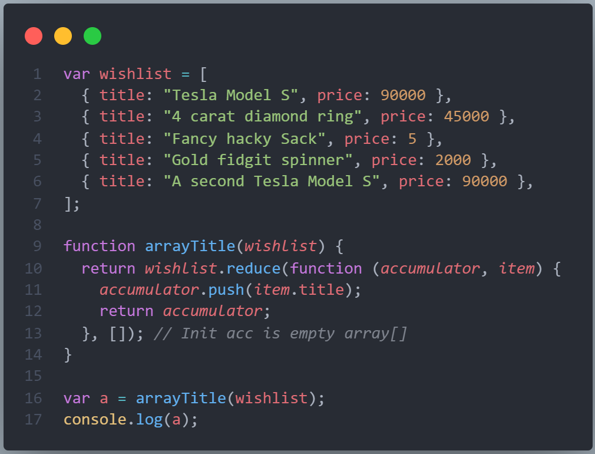

# Array.reduce

## 1. Array.find

- Trả về giá trị đầu tiên trong mảng thỏa điều kiện lọc.
- Không làm thay đổi mảng đã cho.

```js
// array.find => return first value of array.
var items = [4, 5, 6, 7, 8, 9];

var newItems = items.find(function (item) {
  return item % 3 === 0;
});

console.log(items); // [4, 5, 6, 7, 8, 9]
console.log(newItems); // 6
```

## 2. Array.reduce

- Thay đổi mảng (`reduce` => đổi, biến đổi).
- Thuộc tính reduce của mảng nhận vào 2 tham số `accumulator`, `currentValue` (tích lũy, hiện tại) gọi tắt là `acc`, `cur`
- Sẽ đi qua từng phần tử element trong mảng và phần tử đang thực hiện gọi là `currentValue` hay `cur`
- Sau khi xử lý nào đó xong sẽ truyền kết quả về giá trị `accumulator` hay `acc`, và `acc` sẽ tham gia vào xử lý ở phần tử tiếp theo.
- Dùng kết quả của xử lý trước làm đầu vào cho xử lý tiếp theo.


Nghiên cứu thêm tại [Array.reduce tại developer.mozilla.org](https://developer.mozilla.org/en-US/docs/Web/JavaScript/Reference/Global_Objects/Array/Reduce)


### Ví dụ 1:

```js
// Array.reduce
// Tính tổng các phần tử của mảng

var arr = [1, 2, 3, 4, 5];

var sum = arr.reduce(function (acc, cur) {
  return (acc += cur);
});

console.log(sum);
```

### Ví dụ 2:

- Tính tiền của đơn hàng bao gồm các mặt hàng có số lượng và giá.

```js
// Cách này sẽ bị lỗi.

var orders = [
  { item: "A", quantity: 2, price: 1 },
  { item: "B", quantity: 3, price: 2 },
  { item: "C", quantity: 4, price: 3 },
  { item: "D", quantity: 5, price: 4 },
];

var total = orders.reduce(function (total, cur) {
  console.log(total, cur);
  return (total += cur.quantity * cur.price);
});

console.log(total);
```


> Lưu ý : cách chạy này sẽ bị lỗi vì không xác định được total ban đầu là bao nhiêu để cộng vào???

- Ta thêm giá trị khởi tạo đầu tiên cho accumulator hay acc để giải quyết vấn đề lỗi này.

```js
var orders = [
  { item: "A", quantity: 2, price: 1 },
  { item: "B", quantity: 3, price: 2 },
  { item: "C", quantity: 4, price: 3 },
  { item: "D", quantity: 5, price: 4 },
];

var total = orders.reduce(function (total, cur) {
  console.log(total, cur);
  return (total += cur.quantity * cur.price);
}, 0); // Thêm giá trị ban đầu của total là 0 để sử dụng.

console.log(total); // 40 = 2*1 + 3*2 + 4*3 + 5*4
```


> Một cách xử lý lỗi này

```js
var orders = [
  { item: "A", quantity: 2, price: 1 },
  { item: "B", quantity: 3, price: 2 },
  { item: "C", quantity: 4, price: 3 },
  { item: "D", quantity: 5, price: 4 },
];

var total = orders.reduce(function (acc, cur) {
  if (acc == orders[0]) {
    //Kiểm tra acc nếu là phần tử 1 thì xử lý.
    acc = acc.quantity * acc.price + cur.quantity * cur.price;
  } else {
    acc += cur.quantity * cur.price;
  }
  return acc;
});

console.log(total);
```

## Bài tập

### Bài tập 01

1. Turn an array of voter objects into a count of how many people voted.
2. Count of how many people 30 age

```js
var voters = [
  { name: "Bob", age: 30, voted: true },
  { name: "Jake", age: 32, voted: true },
  { name: "Kate", age: 25, voted: false },
  { name: "Sam", age: 20, voted: false },
  { name: "Phil", age: 21, voted: true },
  { name: "Ed", age: 55, voted: true },
  { name: "Tami", age: 54, voted: true },
  { name: "Mary", age: 31, voted: false },
  { name: "Becky", age: 43, voted: false },
  { name: "Joey", age: 41, voted: true },
  { name: "Jeff", age: 30, voted: true },
  { name: "Zack", age: 19, voted: false },
];

function totalVotes(arr) {
  return [];
}

function totalAge(arr, x) {
  return [];
}
```


---

### Bài tập 2

Given an array of all your wishlist items, figure out how much it would cost to just buy everything at once

```js
var wishlist = [
  { title: "Tesla Model S", price: 90000 },
  { title: "4 carat diamond ring", price: 45000 },
  { title: "Fancy hacky Sack", price: 5 },
  { title: "Gold fidgit spinner", price: 2000 },
  { title: "A second Tesla Model S", price: 90000 },
];

function shoppingSpree(wishlist) {
  [];
}
```



---

### Bài tập 3

Given an array of all your wishlist items, returns an array of titles

```js
var wishlist = [
  { title: "Tesla Model S", price: 90000 },
  { title: "4 carat diamond ring", price: 45000 },
  { title: "Fancy hacky Sack", price: 5 },
  { title: "Gold fidgit spinner", price: 2000 },
  { title: "A second Tesla Model S", price: 90000 },
];

function arrayTitle(wishlist) {
  [];
}
```


