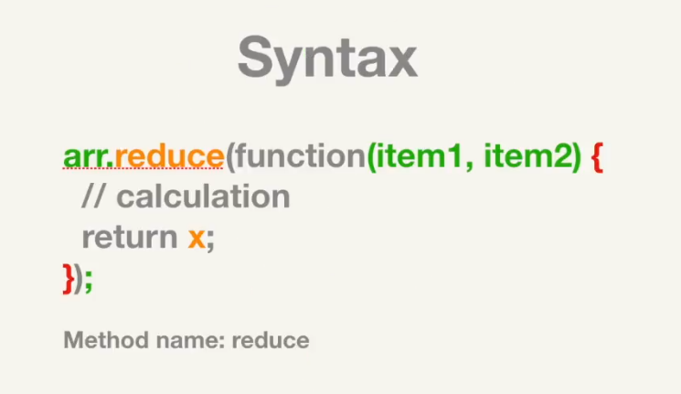
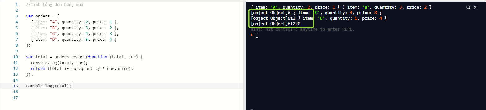
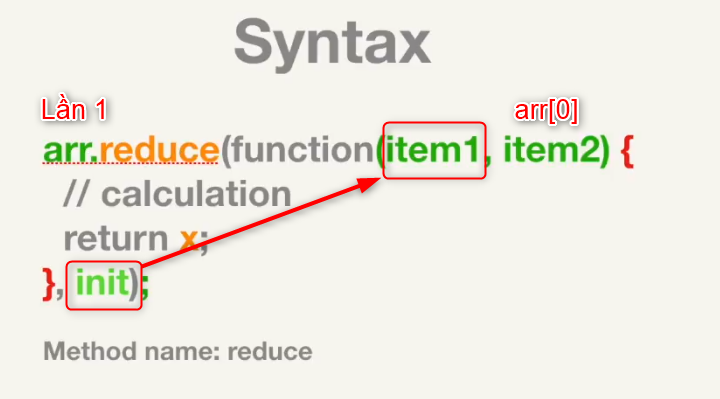
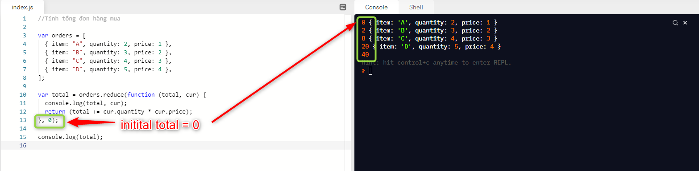
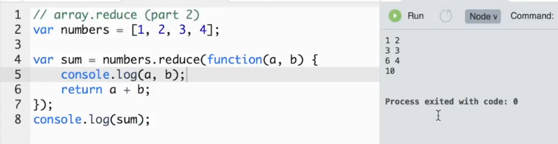
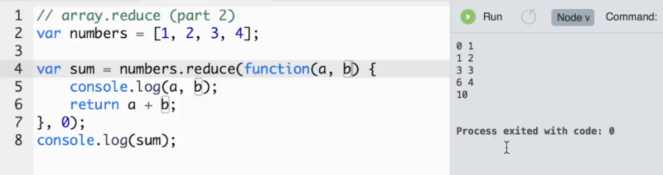

## Array.Reduce (P2)

### Ví dụ

- Với bài toán tính tổng của 1 mảng

```js
// Tính tổng các phần tử của mảng

var arr = [1, 2, 3, 4, 5];

var sum = arr.reduce(function (acc, cur) {
  return (acc += cur);
});

console.log(sum);
```

> Với cách này `SYNTAX` chỉ cần



- Nếu bài toán xử lý hay sử dụng liên quan đến `Object` thì việc áp dụng cách xử lý trên sẽ xảy ra lỗi.

### Ví dụ 2

Tính tổng Bill của hóa đơn mua hàng sau:

```js
var orders = [
  { item: "A", quantity: 2, price: 1 },
  { item: "B", quantity: 3, price: 2 },
  { item: "C", quantity: 4, price: 3 },
  { item: "D", quantity: 5, price: 4 },
];

// Total = ???
var total = orders.reduce(function (total, cur) {
  console.log(total, cur);
  return (total += cur.quantity * cur.price);
});

console.log(total); // fail
```



> Lưu ý : cách chạy này sẽ bị lỗi vì không xác định được total ban đầu là bao nhiêu để cộng vào???

**Một cách khác xử lý**

```js
var orders = [
  { item: "A", quantity: 2, price: 1 },
  { item: "B", quantity: 3, price: 2 },
  { item: "C", quantity: 4, price: 3 },
  { item: "D", quantity: 5, price: 4 },
];

var total = orders.reduce(function (acc, cur) {
  if (acc == orders[0]) {
    //Kiểm tra acc nếu là phần tử 1 thì xử lý.
    acc = acc.quantity * acc.price + cur.quantity * cur.price;
  } else {
    acc += cur.quantity * cur.price;
  }
  return acc;
});

console.log(total);
```

- Để tránh phức tạp, cũng như áp dụng Method Array.reduce có hỗ trợ thêm 1 cách khác theo cấu trúc là:



- Ta thêm giá trị khởi tạo đầu tiên cho accumulator hay acc để giải quyết vấn đề lỗi này.
- Khi này với lần chạy đầu thì sẽ gán giá trị khởi tạo đầu tiên init cho item1 và current sẽ là array[0]
- Áp dụng vào sẽ có cách xử lý là:

```js
var orders = [
  { item: "A", quantity: 2, price: 1 },
  { item: "B", quantity: 3, price: 2 },
  { item: "C", quantity: 4, price: 3 },
  { item: "D", quantity: 5, price: 4 },
];

var total = orders.reduce(function (total, cur) {
  console.log(total, cur);
  return (total += cur.quantity * cur.price);
}, 0); // Thêm giá trị ban đầu của total là 0 để sử dụng.

console.log(total); // 40 = 2*1 + 3*2 + 4*3 + 5*4
```



- init được thêm vào sẽ tùy theo kết quả hiển thị là Number, String, Array, Object thì ta sẽ thêm init cho phù hợp thường sẽ tương ứng như sau:

| STT | Result | Init     |
| --- | ------ | -------- |
| 1   | Number | 0        |
| 2   | String | '' or "" |
| 3   | Array  | []       |
| 4   | Object | {}       |

---

### So sánh chạy debug ở trên:




Ví dụ 2:

- Cho mảng và tạo kết quả `'<Tom><Bill><Anna>'`

```js
var items = ["Tom", "Bill", "Anna"];
// Use reduce to result: '<Tom><Bill><Anna>'

var newItems = items.reduce(function (acc, cur) {
  return (acc += `<${cur}>`);
}, "");

console.log(newItems);
```

---

## Bài tập

### Bài tập 1

```js
// Given an array of arrays, flatten them into a single array
/**
 * Example:
 * var arrays = [
 *    ["1", "2", "3"],
 *    [true],
 *    [4, 5, 6]
 *  ];
 *
 * flatten(arrays) // ["1", "2", "3", true, 4, 5, 6];
 */
function flatten(arr) {
  return arr.reduce(function (item, arrs) {
    return item.concat(arrs);
  }, []);
}

flatten([["1", "2", "3"], [true], [4, 5, 6]]); // ["1", "2", "3", true, 4, 5, 6]

flatten([["1", "2", "3"], [true], [4, 5, false]]); // ["1", "2", "3", true, 4, 5, false]
```

---

### Bài tập 2

```js
/**
 * Count the occurrences of each element inside an array using reduce
 * @params {array}
 * @return {object}
 * Example:
 * countOccurrences(['a', 'b', 'c', 'b', 'a']) // { a: 2, b: 2, c: 1 };
}
*/
function countOccurrences(arr) {
  return arr.reduce(function (arrItems, item) {
    if (item in arrItems) {
      arrItems[item]++;
    } else {
      arrItems[item] = 1;
    }
    return arrItems;
  }, {});
}

countOccurrences(["a", "b", "c", "b", "a"]); // { a: 2, b: 2, c: 1 }
countOccurrences([1, 1, 2, 3, 2]); // { "1": 2, "2": 2, "3": 1 }
countOccurrences(["a", "b", "x", "b", "a"]); // { a: 2, b: 2, x: 1 }
```

---
