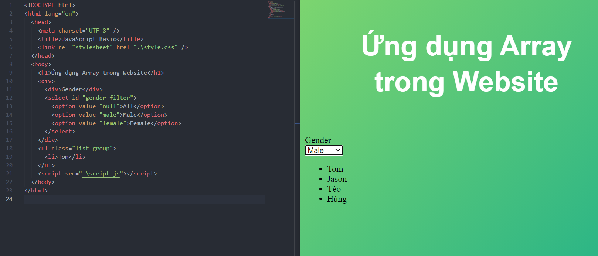
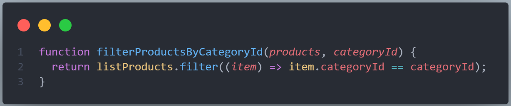
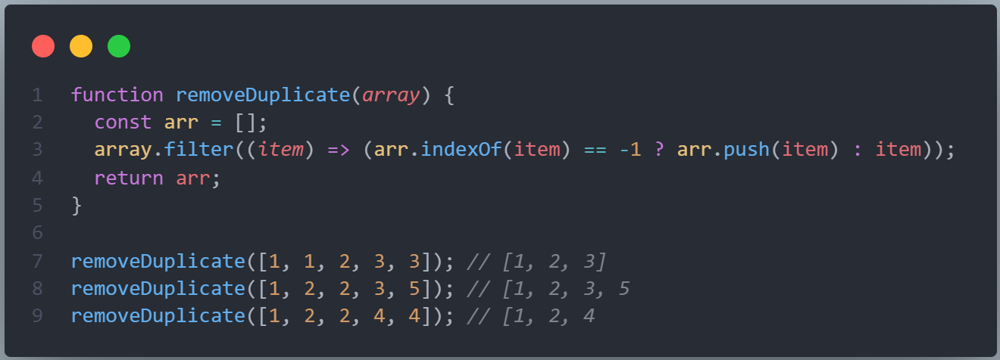

# ỨNG DỤNG THỰC TẾ CÁC METHOD CỦA ARRAY



- Cho danh sách user sẵn
- Khi chọn gender giới tính sẽ filter lọc các user phù hợp và hiển thị.

```html
<!DOCTYPE html>
<html lang="en">
  <head>
    <meta charset="UTF-8" />
    <title>JavaScript Basic</title>
    <link rel="stylesheet" href=".\style.css" />
  </head>
  <body>
    <h1>Ứng dụng Array trong Website</h1>
    <div>
      <div>Gender</div>
      <select id="gender-filter">
        <option value="null">All</option>
        <option value="male">Male</option>
        <option value="female">Female</option>
      </select>
    </div>
    <ul class="list-group">
      <li>Tom</li>
    </ul>
    <script src=".\script.js"></script>
  </body>
</html>
```

```css
body {
  height: 100vh;
  background: linear-gradient(to top left, #28b487, #7dd56f);
}

h1 {
  font-family: sans-serif;
  font-size: 50px;
  line-height: 1.3;
  width: 100%;
  padding: 30px;
  text-align: center;
  color: white;
}
```

```js
var users = [
  { name: "Tom", gender: "male" },
  { name: "Maria", gender: "female" },
  { name: "Jason", gender: "male" },
  { name: "Sarah", gender: "female" },
  { name: "Tèo", gender: "male" },
  { name: "Loan", gender: "female" },
  { name: "Hùng", gender: "male" },
  { name: "Hương", gender: "female" },
];

// Declare
const userList = document.querySelector(".list-group");
const genderFilter = document.querySelector("#gender-filter");

userList.innerHTML = render2(users, "null");

genderFilter.addEventListener("change", function () {
  userList.innerHTML = render(users, genderFilter.value);
});

function render(Items, gender) {
  return Items.filter(function (item) {
    return item.gender === gender || gender === "null";
  })
    .map((item) => item.name)
    .reduce(function (acc, cur) {
      return (acc += `<li ">${cur}</li>`);
    }, "");
}

function render2(Items, gender) {
  var newList = Items.filter(function (item) {
    return item.gender === gender || gender === "null";
  })
    .map((item) => `<li ">${item.name}</li>`)
    .join("");
  return newList;
}
```

- Ở đây khi render có 1 số cách xử lý để đưa ra contents.
  - Dùng array.map() sau đó array.reduce để tạo.
  - Dùng array.map(`<li>Name</li>`) sau đó Array.join("")
  - Dùng vòng lặp kiểu:

```js
function render(Items, gender) {
  var newList = Items.filter(function (item) {
    return item.gender === gender || gender === "null";
  }).map(item.name);

  var result = "";
  for (let item of newList) {
    result += `<li>item</li>`;
  }
  return result;
}
```

---

## Bài Tập

### Bài tập 01:

Filter các sản phẩm khi biết id danh mục sản phẩm

> Ví dụ đây là 1 danh sách các danh mục sản phẩm, khi người dùng muốn lọc các sản phẩm thuộc danh mục nào thì filter các sản phẩm của danh mục đó.

```js
var categories = [
  { id: 1, name: "Đồ điện tử" },
  { id: 2, name: "Đồ gia dụng" },
  { id: 3, name: "Nội thất" },
];
```

```js
var categories = [
  { id: 1, name: "Đồ điện tử" },
  { id: 2, name: "Đồ gia dụng" },
  { id: 3, name: "Nội thất" },
];

var listProducts = [
  { id: 1, categoryId: 1, name: "Tivi" },
  { id: 2, categoryId: 1, name: "Tủ lạnh" },
  { id: 3, categoryId: 3, name: "Ghế sofa" },
  { id: 4, categoryId: 1, name: "Máy giặt" },
  { id: 5, categoryId: 2, name: "Chén bát" },
  { id: 6, categoryId: 2, name: "Nồi cơm điện" },
  { id: 7, categoryId: 3, name: "Cửa kính" },
  { id: 8, categoryId: 1, name: "Điều hoà" },
  { id: 9, categoryId: 3, name: "Bàn tròn" },
  { id: 10, categoryId: 2, name: "Lò vi sóng" },
];

function filterProductsByCategoryId(products, categoryId) {
  return [...];
}

var a = filterProductsByCategoryId(listProducts, 1);
console.log(a);
/*
[
  { id: 1, categoryId: 1, name: "Tivi" },
  { id: 2, categoryId: 1, name: "Tủ lạnh" },
  { id: 4, categoryId: 1, name: "Máy giặt" },
  { id: 8, categoryId: 1, name: "Điều hoà" },
];
*/

a = filterProductsByCategoryId(listProducts, 2);
console.log(a);
/*
[
  { id: 5, categoryId: 2, name: "Chén bát" },
  { id: 6, categoryId: 2, name: "Nồi cơm điện" },
  { id: 10, categoryId: 2, name: "Lò vi sóng" },
];
*/

a = filterProductsByCategoryId(listProducts, 3);
console.log(a);
/*
[
  { id: 3, categoryId: 3, name: "Ghế sofa" },
  { id: 7, categoryId: 3, name: "Cửa kính" },
  { id: 9, categoryId: 3, name: "Bàn tròn" },
];
*/
```

---



---

### Bài tập 2

- Viêt hàm có sử dụng method filter để loại bỏ những phần tử bị lặp lại trong mảng:
- Tìm hiểu thêm indexOf:
- https://developer.mozilla.org/vi/docs/Web/JavaScript/Reference/Global_Objects/Array/indexOf
  Example:
  > removeDuplicate([1, 1, 2, 3, 3]) // [1, 2, 3]

```js
function removeDuplicate(array) {
  array.filter(...) array.indexOf(...);
}

removeDuplicate([1, 1, 2, 3, 3]); // [1, 2, 3]
removeDuplicate([1, 2, 2, 3, 5]); // [1, 2, 3, 5]
removeDuplicate([1, 2, 2, 4, 4]); // [1, 2, 4]
```

---


