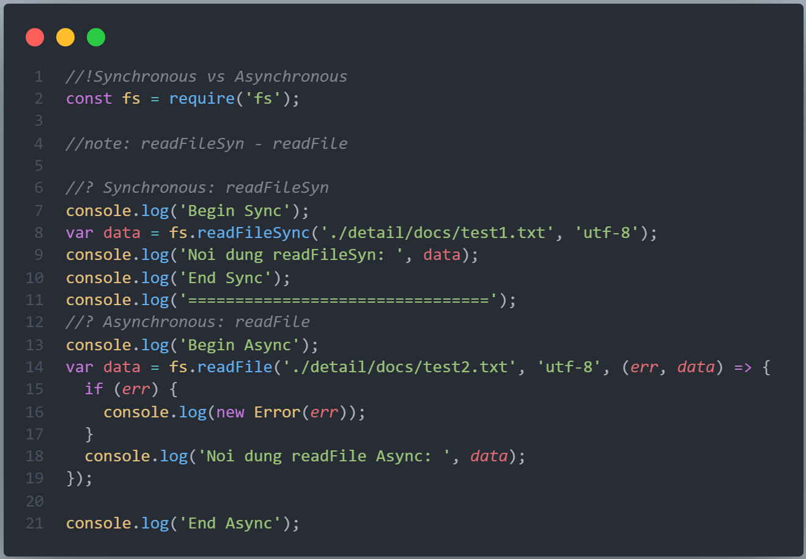

# SYNC. VS. ASYNC

(SYNCHRONOUS VS ASYNCHRONOUS)
LẬP TRÌNH ĐỒNG BỘ VÀ KHÔNG ĐỒNG BỘ

---

## 1. Ví dụ:

- Ta xem ví dụ xử lý đọc file có sẵn là readFileSyn(Đọc file đồng bộ Synchronous) và readFile(Đọc file Bất đồng bộ Asynchronous) trong thư viện fs của NodeJS như sau:

```js
//!Synchronous vs Asynchronous
const fs = require('fs');

//note: readFileSyn - readFile

//? Synchronous: readFileSyn
console.log('Begin Sync');
var data = fs.readFileSync('./detail/docs/test1.txt', 'utf-8');
console.log('Noi dung readFileSyn: ', data);
console.log('End Sync');
console.log('================================');
//? Asynchronous: readFile
console.log('Begin Async');
var data = fs.readFile('./detail/docs/test2.txt', 'utf-8', (err, data) => {
  if (err) {
    console.log(new Error(err));
  }
  console.log('Noi dung readFile Async: ', data);
});

console.log('End Async');
```



Kết quả trả về:


## 2. Nội dung:
